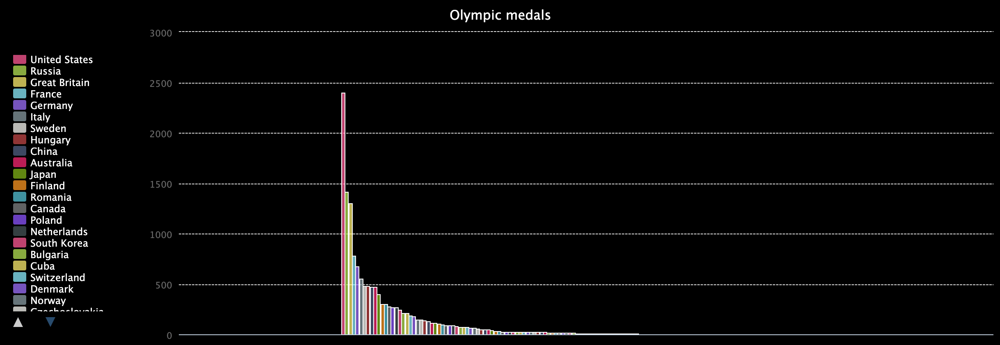

## Introduction

Discover the power of lists in Python by creating an interactive chart of Olympic medals won by different nations.

**The Olympic Games** began in 1896 and are a contest for thousands of athletes, representing hundreds of nations from around the world, across dozens of sporting events. The modern games are inspired by the ancient contests held in Olympia, Greece.

You will:
 - Use **lists** to store related data
 - Create a **chart** using the `pygal` library
 - Load data by having your program **read a file**

--- no-print ---
--- task ---
### Try it

  
Run the program to load the chart. Notice that the chart is interactive. Try clicking the names of different nations to see them dissappear and reappear in the chart.

<iframe src="https://trinket.io/embed/python/9c61a211bf?outputOnly=true&runOption=run" width="600" height="500" frameborder="0" marginwidth="0" marginheight="0" allowfullscreen></iframe>

--- /task ---
--- /no-print ---

--- print-only ---

--- /print-only ---
