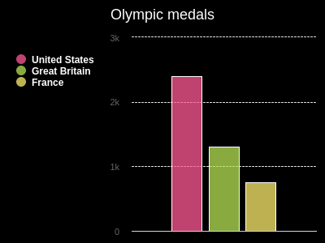

## Chart some data

Create a chart and some lists of data to display on it.

{:width="300px"}

--- task ---

Open the [Charting champions starter project](https://trinket.io/python/61b2224327){:target="_blank"}. Trinket will open in another browser tab.

If you have a Trinket account, you can click on the **Remix button** to save a copy to your `My Trinkets` library.

--- /task ---

The starter project already has some code to import the `pygal` library, which you will use to draw your chart.

[[[pygal-library]]]

### Make a chart

--- task ---

Find the `# Create a chart` comment and add code below it to make a bar chart called `chart`. Then give your chart a title.

--- code ---
---
language: python
filename: main.py
line_numbers: true
line_number_start: 4 
line_highlights: 5-6
---
# Create a chart
chart = Bar()
chart.title = 'Olympic medals'
--- /code ---

--- /task ---

`title` is an **attribute** of your `chart`. Attributes are variables connected to an object. You can use attributes with `.`. For example, `chart.title`.

--- task ---

`chart` also has functions connected with it. Call `chart.render()` to display the chart.

--- code ---
---
language: python
filename: main.py
line_numbers: true
line_number_start: 11 
line_highlights: 12
---
# Display the chart
chart.render()
--- /code ---

--- /task ---

--- task ---

**Test:** Run your code to see the chart. It will be empty, because it doesn't have data yet.

{:width="300px"}

**Debug**: If you see an error about `Bar()` or  `chart.render()` being `not defined`:

 - If the error is for `Bar()`, make sure it has an uppercase 'B' at the start, and parentheses at the end.
 - If the error is for `chart.render()`, check that it has the `.` between `chart` and `render`, as well as the parentheses at the end.

--- /task ---

### Add some data

Python can store related data as a **list**. You can create lists using square brackets `[]`. Items in a list are separated with commas.

--- task ---

Create three lists of data to display on your chart.

--- code ---
---
language: python
filename: main.py
line_numbers: true
line_number_start: 8 
line_highlights: 9-11
---
# Add data to the chart
us = ['United States', 2399]
ru = ['Russia', 1413]
gb = ['Great Britain', 1304]

--- /code ---

--- /task ---

When you store something it gets an **index**: a number that tells you the item's position in the list. List indexes start from `0`, instead of `1`.

--- task ---

You can get an item from a list by its index. For example: `my_list[3]` will get the *fourth* item in `my_list`, because indexes start at `0`.

Use the indexes of your lists and `chart.add()` to display your data.

--- code ---
---
language: python
filename: main.py
line_numbers: true
line_number_start: 11 
line_highlights: 13-15
---
gb = ['Great Britain', 1304]

chart.add(us[0], us[1])
chart.add(ru[0], ru[1])
chart.add(gb[0], gb[1])

--- /code ---

--- /task ---

--- task ---

**Test:** Run your code to see the chart

{:width="300px"}

**Debug**: If you see a message about an `IndexError`, your code is trying to get a value from a list index (e.g. `us[2]`) that doesn't exist. To fix this:
 - Check each of your `chart.add` lines to be sure you are only using `0` and `1` as indexes
 - Check the lines where you created your lists. Make sure each list has two items, separated by a comma.

--- /task ---

--- save ---