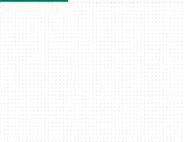
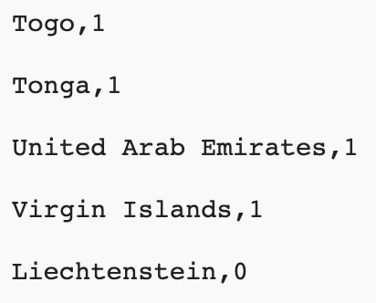
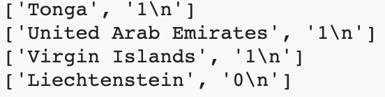
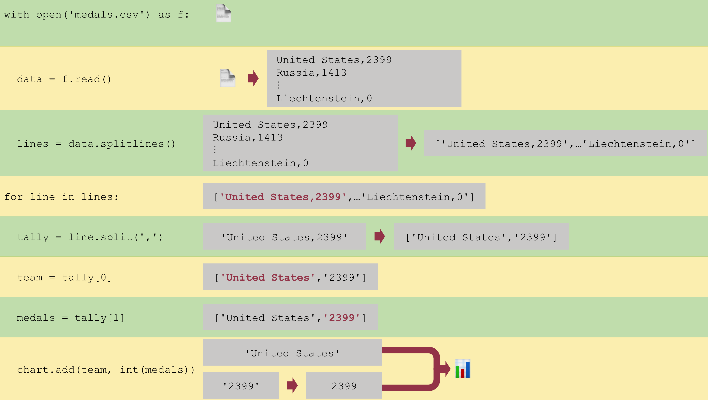

## Load data from a file

The chart looks good! But, almost 150 nations have competed in the Olympics. To chart them, you're going to load their data from a file. It will save a lot of typing!

{:width="300px"}

--- task ---

Open the [second starter project](https://trinket.io/python/b8e0125fe2){:target="_blank"}. Trinket will open in another browser tab.

If you have a Trinket account, you can click on the **Remix button** to save a copy to your `My Trinkets` library.

--- /task ---

--- task ---

The `medals.csv` file included in this starter project contains the data you need. You can load the file into a variable by using `with open() as` and `read()`.

[[[generic-python-file-read]]]

--- code ---
---
language: python
filename: main.py
line_numbers: true
line_number_start: 8 
line_highlights: 9-10
---
# Add data to the chart
with open('medals.csv') as f:
  data = f.read()
--- /code ---

--- /task ---

**CSV files** are **c**omma-**s**eparated **v**alues files. They contain data in rows and columns, like a table. Each line is a row, with commas separating that row's values into columns.
{:width="200px"}

--- task ---

The text in `data` is one long string, which you need to split into the names of teams and the number of medals they have won. 

Use the `splitlines()` function to split the string into a list, just like the lists you made earlier. Each line in the string will become an item in the list. Then `print()` those items.

--- code ---
---
language: python
filename: main.py
line_numbers: true
line_number_start: 9 
line_highlights: 11-12
---
with open('medals.csv') as f:
  data = f.read()
  lines = data.splitlines()
  print(lines)
--- /code ---

--- /task ---

--- task ---

**Test:** Run your code and look at the text it prints out. 

Notice that the list has the same square brackets (`[]`) you used to make a list. Also, the items in the list are separated by commas, like your lists were.

{:width="400px"}

**Debug:** If the code doesn't work, make sure you have indented it under `with`, like in the example above.

**Debug:** If you see a message about `read` or `splitlines` being 'not defined':
 - check that you have included `f.` before `read()` 
 - check that you have included `data.` before `splitlines()`

--- /task ---

It's useful to print `lines` out to check your program is working properly. But you don't need to do it every time the program runs.

--- task ---

Put a `#` in front of the code that prints `lines`. This will turn that code into a comment, so Python will ignore it.

--- code ---
---
language: python
filename: main.py
line_numbers: true
line_number_start: 9 
line_highlights: 12
---
with open('medals.csv') as f:
  data = f.read()
  lines = data.splitlines()
  #print(lines)
--- /code ---

--- /task ---

The strings in the `lines` list are all made up of two pieces separated by a comma. Your `chart.add()` function needs each of those pieces as separate inputs.

The `split()` function breaks a string into pieces. `split(',')` makes a new piece every time it sees a comma. Each of these pieces becomes an item in the new list `split()` creates.

--- task ---

Use a `for` loop on `lines`, along with the `split()` function, to split each string into its own list. Then print those lists out.

--- code ---
---
language: python
filename: main.py
line_numbers: true
line_number_start: 9 
line_highlights: 14-16
---
with open('medals.csv') as f:
  data = f.read()
  lines = data.splitlines()
  #print(lines)

for line in lines:
  tally = line.split(',')
  print(tally) # Print each list
--- /code ---

**Tip:** `split()` can split a string into a list around any text you want. You can split on punctuation, a letter, or even whole words.

--- /task ---

--- task ---

**Test:** Run your code and look at the text it prints out. Each line should be a list with two items.

{:width="400px"}

**Debug:** If your `tally` is printing out as lists with only one item then check that you have `','` in the `()` of `line.split()`.

**Debug:** If you see a message about `split` being 'not defined', check that you have included `line.` before it.

--- /task ---

--- task ---

Load your data into the chart using the same `for` loop you just created.

--- code ---
---
language: python
filename: main.py
line_numbers: true
line_number_start: 14 
line_highlights: 17-19
---
for line in lines:
  tally = line.split(',')
  print(tally)
  team = tally[0]
  medals = tally[1]
  chart.add(team, int(medals))  # Make medals a number
--- /code ---

--- /task ---

--- task ---

**Test:** Run your code and look at the chart it creates. Try hovering over some of the bars, or clicking on the names of teams to add and remove them from the chart.

{:width="400px"}

**Debug:** If your chart is empty, check that you have `int(medals)` in your `chart.add()`.

**Debug:** If you see a message about an `IndexError`, your code is trying to get a value from a list index (e.g. `tally[2]`) that doesn't exist. To fix this:
 - Check each of your `team` and `medals` variables to be sure you are only using `0` and `1` as indexes
 - Check the printed `tally` lists to be sure they have two items: `['Tonga', '1']`, not `['Tonga,1']`. If they don't, then check that you have `','` in the `()` of `line.split()`.

--- /task ---

--- save ---

### How does this code work?

You can see the details of how your code loads data to the chart below:

