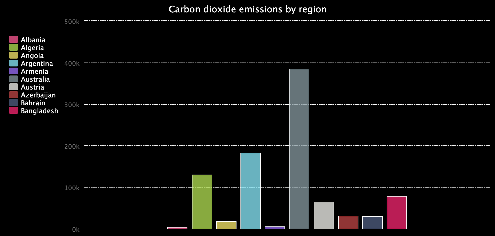

## Upgrade your project

In this step, change how your chart looks, or what data it uses.

{:width="300px"}

### Use a Pie chart
Try using a pie chart for a different look, or to show how something is divided.

--- task ---

To create a pie chart instead of a bar chart, change the import from `pygal` to `Pie` instead of `Bar`. Do the same for the function you call to create `chart`. 

--- /task ---

### Display the first ten items

Try showing only the first ten items on your chart, so it's easier to see and compare them.

{:width="300px"}

--- task ---

To display fewer items on the chart, only `add()` a certain number of items from the `lines` list. 

You can use `range()` to make a list of numbers, then you can use those numbers as list indexes. For example, you could print the first five items on a list with this code:

--- code ---
---
language: python
filename: main.py
---

for i in range(5):
  print(my_list[i])

--- /code ---

--- /task ---

### Use a different set of data
You can load and chart any data that's in a `.csv` file with the program you've written.

--- task ---

**Choose:** Pick a different datafile in your project. There are two available:

 - `mcu.csv` is the runtime and gross income from Marvel Cinematic Universe films
 - `carbon.csv` is the total (thousands of tons) and per-person (tons) carbon dioxide emissions of different countries and regions

--- /task ---

--- task ---

Update the code that reads from `data.csv` to read from your new file. 

These files have more than one column of numbers. Use indexes on the `tally` list to choose which to add to your chart. 

The carbon dioxide data uses numbers with decimals. To convert them from text strings, you'll need to use `float()` instead of `int()`.

--- /task ---

--- collapse ---
---
title: Completed project
---

You can view the [completed project here](https://trinket.io/python/1f312ddc4c).

--- /collapse ---

--- save ---