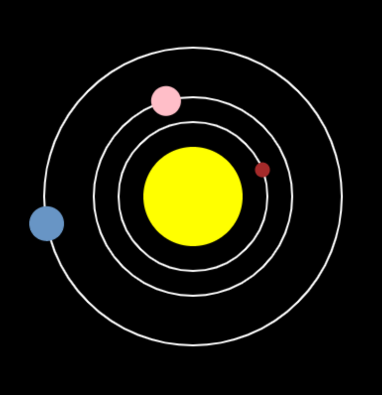

## What next?

If you are following the [More Python](https://projects.raspberrypi.org/en/pathways/more-python) pathway, you can move on to the [Solar system simulator](https://projects.raspberrypi.org/en/projects/solar-system-simulator/) project. In this project, you will create a simulation of the solar system that teaches the user about the planets.

--- print-only ---

--- /print-only ---

--- no-print ---

<iframe src="https://trinket.io/embed/python/8ca5f598e2?runOption=run" width="600" height="500" frameborder="0" marginwidth="0" marginheight="0" allowfullscreen></iframe>

--- /no-print ---

If you want to have more fun exploring Python, then you could try out any of [these projects](https://projects.raspberrypi.org/en/projects?software%5B%5D=python).
