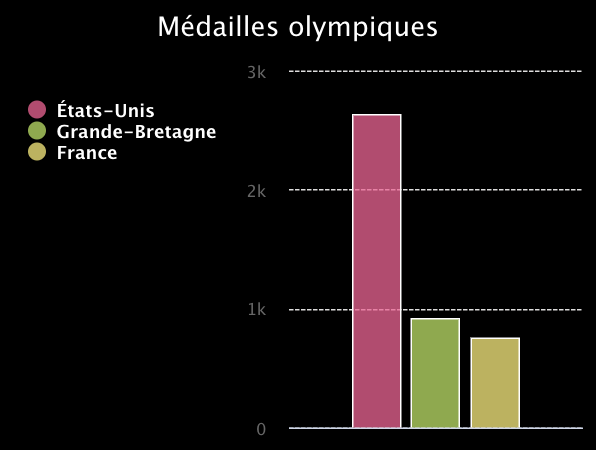
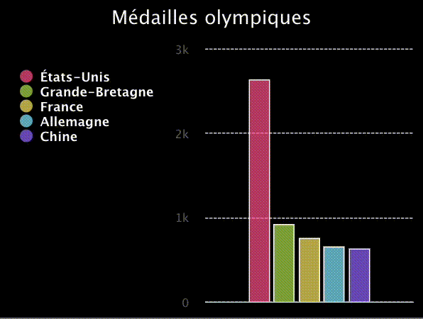

## Créer un graphique

<div style="display: flex; flex-wrap: wrap">
<div style="flex-basis: 200px; flex-grow: 1; margin-right: 15px;">
Crée un graphique et des listes de données à afficher dessus.
</div>
<div>
{:width="300px"}
</div>
</div>

--- task ---

Ouvre le [projet de démarrage Champions du classement](https://editor.raspberrypi.org/fr-FR/projects/charting-champions-starter){:target="_blank"}. Le Code Editor Raspberry Pi s'ouvre dans un autre onglet du navigateur.

Si tu as un compte Raspberry Pi, tu peux cliquer sur **Enregistrer** pour enregistrer une copie du code de démarrage dans ta bibliothèque.

Si tu n'utilises pas le Code Editor dans ton navigateur, tu devras télécharger les fichiers du projet et tu devras peut-être installer `pygal` avant de pouvoir l'importer.

--- collapse ---

---
title: Fichiers de projet hors ligne
---

Télécharge les fichiers du projet, décompresse-les et stocke-les sur ton ordinateur. Pour cette étape, tu auras besoin de `starter.py`, les autres fichiers seront utilisés plus tard dans le projet.

--- /collapse ---

--- collapse ---
---
title: Installer pygal
---

### Sur Windows
Dans **l'invite de commande**, tape ce qui suit et appuie sur la touche <kbd>Entrée</kbd> :

```
pip install pygal
```

Attends que l'installation se termine, puis poursuis le projet.

### Sur Mac
Dans le **Terminal**, tape ce qui suit et appuie sur la touche <kbd>Entrée</kbd> :

```
pip3 install pygal
```

Attends que l'installation se termine, puis poursuis le projet.

### Sur Linux, y compris Raspberry Pi OS
Dans le **Terminal**, tape ce qui suit et appuie sur la touche <kbd>Entrée</kbd> :

```
pip install pygal
```

Attends que l'installation se termine, puis poursuis le projet.

--- /collapse ---

--- /task ---

Le projet de démarrage contient déjà du code pour importer la bibliothèque `pygal`, que tu utiliseras pour dessiner ton graphique.

--- code ---
---
language: python
filename: main.py
line_numbers: true
line_number_start: 1
line_highlights: 1
---

from pygal import bar

--- /code ---

### Créer un graphique

--- task ---

Recherche le commentaire `# Créer un graphique` et ajoute du code en dessous pour créer un graphique à barres appelé `graphique`. Donne un titre à ton graphique à l'intérieur des parenthèses.

--- code ---
---
language: python
filename: main.py
line_numbers: true
line_number_start: 4 
line_highlights: 5
---
# Créer un graphique
graphique = Bar(title='Médailles olympiques')

--- /code ---

--- /task ---

--- task ---

Appelle `graphique.render()` pour afficher le graphique.

--- code ---
---
language: python
filename: main.py
line_numbers: true
line_number_start: 11 
line_highlights: 12
---
# Afficher le graphique
graphique.render()
--- /code ---

--- /task ---

--- task ---

**Test :** exécute ton code pour voir le graphique. Il sera vide, car il ne contient pas encore de données.

{:width="300px"}

**Débogage** : si tu vois une erreur indiquant que `Bar()` ou `graphique.render()` n'est pas défini (`not defined`) :

 - Si l'erreur concerne `Bar()`, vérifie qu'il y a bien un B majuscule au début et des crochets à la fin.
 - Si l'erreur concerne `graphique.render()`, vérifie qu'il y a bien un `.` entre `graphique` et `render`, ainsi que des crochets à la fin.

**Débogage** : si tu n'utilises pas le Code Editor Raspberry Pi, et que le graphique ne s'est pas affiché lorsque tu as exécuté ton code, remplace `graphique.render()` par `graphique.render_in_browser()`.

--- /task ---

### Ajouter des données

Python peut stocker des données associées sous forme de **liste**. Tu peux créer des listes en utilisant des crochets `[]`. Les éléments d'une liste sont séparés par des virgules.

--- task ---

Crée trois listes de données à afficher sur ton graphique.

Chaque liste stockera le nom d'une nation et le nombre de médailles remportées par cette nation.

--- code ---
---
language: python
filename: main.py
line_numbers: true
line_number_start: 7 
line_highlights: 8-10
---
# Ajouter des données au graphique
us = ['États-Unis', 2399]
gb = ['Grande-Bretagne', 1304]
fr = ['France', 751]

--- /code ---

--- /task ---

Lorsque tu places un élément dans une liste, il est associé à un **index**. Un index est un numéro qui indique la position d'un élément dans une liste. Les index de liste commencent à `0`, et non à `1`.

--- task ---

Tu peux obtenir un élément d'une liste par son index. Par exemple, `ma_liste[3]` obtient le **quatrième** élément de `ma_liste`, car les index commencent à `0`.

Utilise les index de tes listes et `graphique.add()` pour afficher tes données. Le nom de la nation, correspondant à l'élément 0, sera utilisé comme libellé de catégorie pour le graphique et le nombre de médailles, correspondant à l'élément 1, déterminera la hauteur de la barre.

--- code ---
---
language: python
filename: main.py
line_numbers: true
line_number_start: 10 
line_highlights: 12-14
---
gb = ['Grande-Bretagne', 1304]

graphique.add(us[0], us[1])
graphique.add(gb[0], gb[1])
graphique.add(fr[0], fr[1])

--- /code ---

--- /task ---

--- task ---

**Test :** exécute ton code pour voir le graphique.

{:width="300px"}

**Débogage** : si tu vois un message `IndexError`, ton code essaie d'obtenir une valeur à partir d'un index de liste qui n'existe pas (par exemple, `us[2]`). Pour résoudre cette erreur :
 - Vérifie chacune de tes lignes `graphique.add` pour être sûr que tu utilises uniquement `0` et `1` comme index.
 - Vérifie les lignes où tu as créé tes listes. Chaque liste doit comporter deux éléments, séparés par une virgule.

--- /task ---

--- task ---

Maintenant, charge deux équipes supplémentaires en ajoutant des listes et des appels `graphique.add()`.

--- code ---
---
language: python
filename: main.py
line_numbers: true
line_number_start: 7 
line_highlights: 11-12, 17-18
---
# Ajouter des données au graphique
us = ['États-Unis', 2399]
gb = ['Grande-Bretagne', 1304]
fr = ['France', 751]
ge = ['Allemagne', 655]
ch = ['Chine', 636]

graphique.add(us[0], us[1])
graphique.add(gb[0], gb[1])
graphique.add(fr[0], fr[1])
graphique.add(ge[0], ge[1])
graphique.add(ch[0], ch[1])

--- /code ---

--- /task ---

--- task ---

**Test :** exécute ton code pour voir le graphique mis à jour. Essaie de cliquer sur États-Unis. Observe ensuite l’échelle du graphique changer.

{:width="300px"}

**Débogage** : si tu vois un message `IndexError`, ton code essaie d'obtenir une valeur à partir d'un index de liste qui n'existe pas (par exemple, `fr[2]`). Pour résoudre cette erreur :
 - Vérifie chacune de tes lignes `graphique.add` pour être sûr que tu utilises uniquement `0` et `1` comme index.
 - Vérifie les lignes où tu as créé tes listes. Chaque liste doit comporter deux éléments, séparés par une virgule.

--- /task ---

--- save ---
