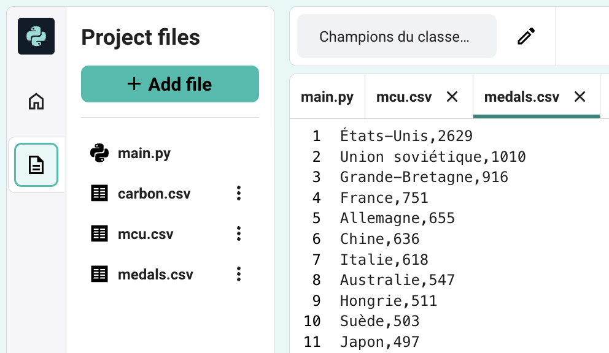
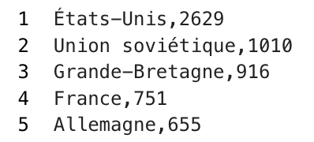
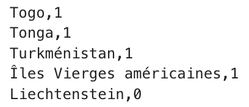
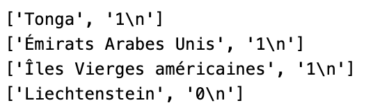

## Charger les données à partir d'un fichier

Le graphique est chouette ! Mais près de 150 nations ont participé aux Jeux olympiques. Pour les présenter sous forme de graphique, tu vas charger leurs données à partir d'un fichier. Cela t'évitera de saisir beaucoup de données !

{:width="300px"}

**Ordinateurs et données** Tu commences tout juste à apprendre à utiliser ton ordinateur pour qu'il traite des données. Les ordinateurs peuvent faire des choses étonnantes avec les bonnes données. Et ils peuvent lire plus de données en quelques minutes qu’un humain ne pourrait le faire en plusieurs années. Python est l'un des meilleurs langages de programmation qui existent pour les données. Python est la base de l'algorithme YouTube, qui sélectionne les vidéos à te montrer.

--- task ---

Ouvre le [deuxième projet de démarrage](https://editor.raspberrypi.org/en/projects/charting-champions-second-starter){:target="_blank"}. Le Code Editor Raspberry Pi s'ouvre dans un autre onglet du navigateur.

Si tu as un compte Raspberry Pi, tu peux cliquer sur **Enregistrer** pour enregistrer une copie du code de démarrage dans ta bibliothèque.

--- collapse ---

---
title: Travailler hors ligne
---

Tu auras besoin de `starter2.py` et des fichiers `.csv` pour cette étape.

--- /collapse ---

--- /task ---

Ce projet de démarrage inclut plusieurs fichiers `.csv` qui contiennent les données dont tu as besoin pour tes graphiques.

--- task ---

Ouvre `medals.csv` et examine les données qu'il contient. Remarque comme chaque ligne porte le nom d'une équipe et le nombre de médailles qu'elle a remportées, séparés par une virgule.

--- /task ---

**Les fichiers CSV** sont des fichiers de valeurs séparées par des virgules. Ils contiennent des données en lignes et en colonnes, comme un tableau. Chaque ligne est un enregistrement, avec des virgules séparant les valeurs de cette ligne en colonnes.
{:width="200px"}

Tu devras convertir chaque ligne de `medals.csv` en une chaîne de texte et un nombre en Python, comme dans les listes que tu as créées.

--- task ---

Clique sur l'onglet `main.py` et ajoute du code pour charger le fichier dans une variable en utilisant `with open() as`. Utilise ensuite une boucle `for` pour imprimer, `print`, chaque ligne de la variable.

La boucle `for` te permettra de répéter le code. Tu peux donc charger des centaines d’équipes dans ton graphique avec seulement quelques lignes de code !

[[[generic-python-file-read]]]

--- code ---
---
language: python filename: main.py line_numbers: true line_number_start: 8
line_highlights: 9-11
---
# Add data to the chart
with open('medals.csv') as f: for line in f: print(line) --- /code ---

--- /task ---

--- task ---

**Test :** exécute ton code, et regarde le texte qu'il imprime.

Tu remarqueras que chaque ligne comporte deux valeurs, séparées par des virgules.

**Débogage :** si le code ne fonctionne pas, vérifie que tu as bien mis une indentation sous la ligne `with`, comme dans l'exemple ci-dessus.

--- /task ---

Chaque chaîne imprimée par ta boucle est composée de deux éléments séparés par une virgule. Ta fonction `graphique.add()` a besoin de chacun de ces éléments comme entrées distinctes.

La fonction `split()` divise une chaîne en une liste, tout comme les listes que tu as créées précédemment. La fonction `split(',')` crée un nouvel élément de liste à chaque fois qu'elle voit une virgule.

--- task ---

Mets un `#` devant le code qui imprime la `ligne`. Cela transformera ce code en commentaire, donc Python l'ignorera.

Utilise la méthode `split()` pour diviser chaque chaîne au niveau de `,` et stocker ensuite le premier et le deuxième élément dans une nouvelle liste. Imprime ensuite ces listes.

--- code ---
---
language: python filename: main.py line_numbers: true line_number_start: 9
line_highlights: 12-13
---
with open('medals.csv') as f: for line in f: #print(line) pieces = line.split(',') # Breaks the string into a list print(pieces) # Print each list --- /code ---

**Astuce :** `split()` peut diviser une chaîne en une liste autour du texte de ton choix. Tu peux la diviser au niveau de la ponctuation, d'une lettre ou même de mots entiers.

--- /task ---

--- task ---

**Test :** exécute ton code, et regarde le texte qu'il imprime. Chaque ligne doit être une liste de deux éléments. Tu remarqueras peut-être que le deuxième élément a `\n` à la fin. `\n` est généralement invisible. Il indique à l'ordinateur qu'il a atteint la fin de la ligne dans un fichier.

{:width="400px"}

**Débogage :** si tes `elements` impriment des listes avec un seul élément, alors vérifie que tu as bien `','` dans le `()` de `ligne.split()`.

**Débogage :** si tu vois un message indiquant que `split` est "non défini", vérifie que tu as bien inclus `ligne.` avant.

--- /task ---

--- task ---

Charge tes données dans le graphique dans le cadre de ta boucle `for` . `equipe` est une chaîne et peut donc être utilisée comme libellé sur le graphique. `medaille` est actuellement une chaîne, mais doit être convertie en nombre. Tu peux utiliser la fonction `int()` pour **convertir** une chaîne en nombre.

--- code ---
---
language: python filename: main.py line_numbers: true line_number_start: 9
line_highlights: 14-16
---
with open('medals.csv') as f: for line in f: #print(line) pieces = line.split(',') #print(pieces) team = pieces[0] medals = pieces[1] chart.add(team, int(medals))  # Make medals a number --- /code ---

**Astuce :** tu peux maintenant utiliser `#` pour transformer `print(elements)` en un commentaire également.

--- /task ---

--- task ---

**Test :** exécute ton code, et regarde le graphique qu'il crée. Essaie de survoler certaines barres ou de cliquer sur les noms des équipes pour les ajouter et les supprimer du graphique.

{:width="400px"}

**Débogage :** si ton graphique est vide, vérifie que tu as `int(medailles)` dans `graphique.add()`.

**Débogage :** si tu vois un message `IndexError`, ton code essaie d'obtenir une valeur à partir d'un index de liste qui n'existe pas (par exemple, `elements[2]`). Pour résoudre cette erreur :
 - Vérifie chacune de tes variables `equipe` et `medailles` pour t'assurer que tu n'utilises que `0` et `1` comme index.
 - Vérifie les listes `elements` imprimées pour t'assurer qu'elles ont deux éléments : `['Tonga', '1\n']`, et non `['Tonga,1\n']`. Si ce n'est pas le cas, vérifie que tu as `','` dans les `()` de `ligne.split()`.
 - Vérifie que tu n'as pas de ligne vide en bas de ton fichier .csv.

--- /task ---

--- save ---
