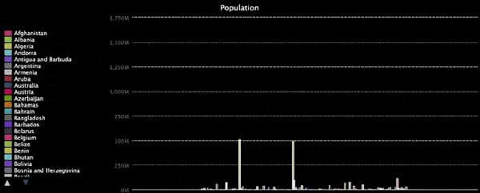

## Examiner les données

Ton programme peut désormais dessiner des graphiques à partir de fichiers de données. Tu peux l'utiliser sur différents fichiers pour comparer leurs graphiques et voir ce qu'ils peuvent t'apprendre.

{:width="300px"}

### Qui a le plus de médailles ?

--- task ---

Regarde le graphique que tu as créé. Plus une barre est haute, plus cette équipe a remporté de médailles. Survole certaines des barres les plus hautes avec la souris et remarque à quelles équipes elles appartiennent.

{:width="500px"}

Pourquoi ont-elles le plus de médailles ?

--- /task ---

Une bonne idée pourrait être d’examiner à la fois la population et la richesse des équipes, pour voir s’il existe une tendance.

**Analyse des données :** les gens ont mené ce genre d'enquête bien avant l'invention des ordinateurs. Par exemple, dans les années 1850, l'infirmière Florence Nightingale utilisait des tableaux et des graphiques pour montrer l’importance de la prévention dans les soins aux malades. 
{:width="300px"}

### Tailles de la population

Un fichier, appelé `pop.csv`, contenant des données sur les populations de différents pays, fait partie du projet de démarrage. Étant donné que les données de `pop.csv` sont également constituées d'une chaîne de texte et d'un nombre, tu peux réutiliser ton code avec seulement de petites modifications.

--- task ---

Modifie le titre du graphique, la `largeur` du graphique, le fichier à ouvrir et le nom de la catégorie pour dessiner un graphique basé sur les données de population de `pop.csv`.

--- code ---
---
language: python filename: main.py line_numbers: true line_number_start: 6
line_highlights: 6, 9, 15, 16
---
chart = Bar(title='Population', width='600')

# Add data to the chart
with open('pop.csv') as f: for line in f: #print(line) pieces = line.split(',') #print(pieces) team = pieces[0] population = pieces[1] chart.add(team, int(population))  # Make population a number --- /code ---

--- /task ---

--- task ---

Maintenant, exécute ton programme et regarde le graphique qu'il dessine.

{:width="500px"}

Survole les barres les plus hautes avec la souris et remarque à quels pays elles appartiennent. Clique sur les noms des très grandes pour les supprimer du graphique ; cela te permettra d'examiner les autres de plus près. Y a-t-il des pays très peuplés qui ont un grand nombre de médailles ?

--- /task ---

### Richesse

Un fichier appelé `gdp.csv` fait partie du projet de démarrage. Il contient des données sur le PIB annuel de différents pays. Tout comme avec `pop.csv`, tu n'auras qu'à apporter de petites modifications pour l'utiliser.

**PIB** est le produit intérieur brut. Il mesure la valeur monétaire de tout ce qui est produit dans une région sur une période donnée. Il permet de mesurer la richesse d’une région.

--- task ---

Modifie le titre du graphique, le fichier à ouvrir et le nom de la catégorie pour dessiner un graphique basé sur les données de PIB de `gdp.csv`.

Le fichier `gdp.csv` stocke le PIB sous forme de valeurs décimales. Change le type de `int` à `float` afin que les valeurs soient au format correct.

--- code ---
---
language: python filename: main.py line_numbers: true line_number_start: 6
line_highlights: 6, 9, 15, 16
---
chart.title = 'GDP'

# Add data to the chart
with open('gdp.csv') as f: for line in f: #print(line) pieces = line.split(',') #print(pieces) team = pieces[0] gdp = pieces[1] chart.add(team, float(gdp))  # Make GDP a number --- /code ---

--- /task ---

--- task ---

Maintenant, exécute ton programme et regarde le graphique qu'il dessine.

{:width="500px"}

Survole les barres les plus hautes avec la souris et remarque à quels pays elles appartiennent. Clique sur les noms des très grandes pour les supprimer du graphique ; cela te permettra d'examiner les autres de plus près. Certaines équipes des pays les plus riches ont-elles remporté un très grand nombre de médailles ?

--- /task ---

### Qu'as-tu remarqué ?
Qu'as-tu découvert en utilisant ton programme pour examiner ces données ?

 - Certains signes indiquent que le nombre de personnes parmi lesquelles une équipe doit choisir l'aide à remporter des médailles.
 - Mais la population n'explique pas pourquoi des pays comme la France ont autant de médailles. Ou pourquoi l'Inde n'a pas autant de médailles que la Chine ou les États-Unis.
 - L'argent semble être plus déterminant. La plupart des pays qui ont beaucoup de médailles ont également un PIB élevé.
 - Aucun des deux n'explique tout. Il y a des équipes qui ne suivent pas ce modèle.

--- collapse ---
---
title: La Jamaïque fait mieux que des pays plus grands et plus riches
---
Ce n'est pas un problème qu'on trouve dans un livre de mathématiques. La réponse n’est donc pas simple. Par exemple, regarde la Jamaïque. La Jamaïque n'a pas une grande population ni un PIB important.

Le Mexique, l’Irlande, le Portugal, l’Arabie saoudite et Singapour ont tous plus d’habitants et plus d’argent. Ils ont même plus d'argent par personne. Mais la Jamaïque a remporté plus de médailles que n’importe lequel d’entre eux !

--- /collapse ---

Il faut donc bien plus que des personnes et de l’argent pour remporter des médailles olympiques. Qu'est-ce que ça pourrait être d'autre ? Quelles autres idées pourrais-tu tester, et de quel type de données aurais-tu besoin pour le faire ?
