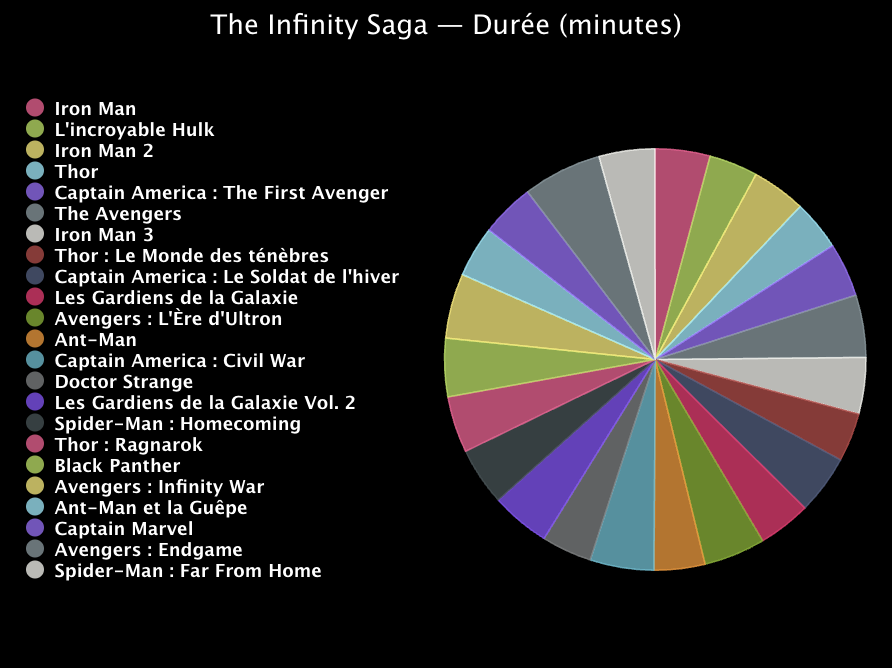

## Améliorer ton projet

Au cours de cet exercice, modifie l'apparence de ton graphique ou les données qu'il utilise.

{:width="300px"}

### Utiliser un camembert
Essaie d'utiliser un camembert pour un look différent ou pour montrer comment quelque chose est divisé.

--- task ---

Pour créer un camembert au lieu d'un graphique à barres, change l'importation de `pygal` sur `Pie` au lieu de `Bar`. Fais de même pour la fonction que tu appelles pour créer un `graphique`.

--- /task ---

### Utiliser un autre ensemble de données
Tu peux charger et tracer toutes les données contenues dans un fichier `.csv` avec le programme que tu as écrit.

--- task ---

**Choisir :** sélectionne un fichier de données différent pour ton projet. Il y en a deux :

 - `mcu.csv` est la durée et le revenu brut des films Marvel Cinematic Universe
 - `carbon.csv` est le total (en milliers de tonnes) et par personne (tonnes) des émissions de dioxyde de carbone de différents pays et régions

--- /task ---

--- task ---

Mets à jour le code qui lit à partir de `medals.csv` pour qu'il lise à partir de ton nouveau fichier.

Ces fichiers comportent plusieurs colonnes de nombres. Utilise les index de la liste `tally` pour choisir lesquels ajouter à ton graphique.

Les données sur le dioxyde de carbone utilisent des nombres avec des décimales. Pour les convertir à partir de chaînes de texte, tu devras utiliser `float()` au lieu de `int()`.

--- /task ---

--- collapse ---
---
title: Le projet terminé
---

Tu peux voir le [projet terminé ici](https://editor.raspberrypi.org/fr-FR/projects/charting-champions-example){:target="_blank"}.

--- /collapse ---

--- save ---
