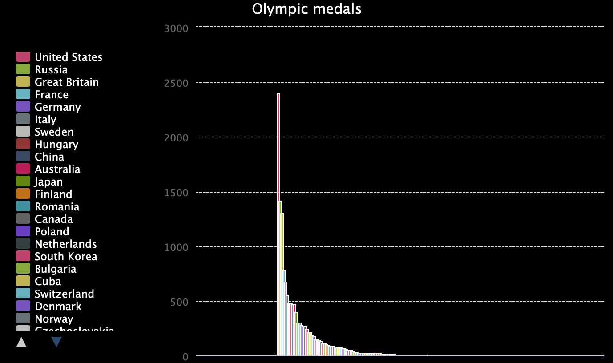

  <a class="c-survey-banner__link" href="https://form.raspberrypi.org/f/code-editor-feedback" target="_blank">Vul onze enquête in</a> om onze Code Editor te helpen verbeteren!

## Wat ga je maken

Ontdek de kracht van lijsten in Python door een interactieve grafiek van Olympische medailles te maken.

**De Olympische Spelen** begonnen in 1896: duizenden atleten vertegenwoordigen honderden landen van over de hele wereld. De moderne spelen zijn geïnspireerd op oude wedstrijden die in Olympia, Griekenland, werden gehouden.

Je gaat:
 - Gebruik maken van **lijsten** om gerelateerde gegevens op te slaan
 - Een **grafiek** maken met behulp van de `pygal` bibliotheek
 - Gegevens laden door je programma **een bestand te laten lezen**

--- no-print --- --- task ---
### Afspelen ▶️

  
Voer het programma uit om de grafiek te laden. Merk op dat de grafiek interactief is. Wat gebeurt er als je op de drie beste landen in het overzicht aan de linkerkant klikt?

<iframe src="https://editor.raspberrypi.org/en/embed/viewer/charting-champions-example" width="600" height="600" frameborder="0" marginwidth="0" marginheight="0" allowfullscreen>
</iframe>

--- /task --- --- /no-print ---

--- print-only ---  --- /print-only ---

