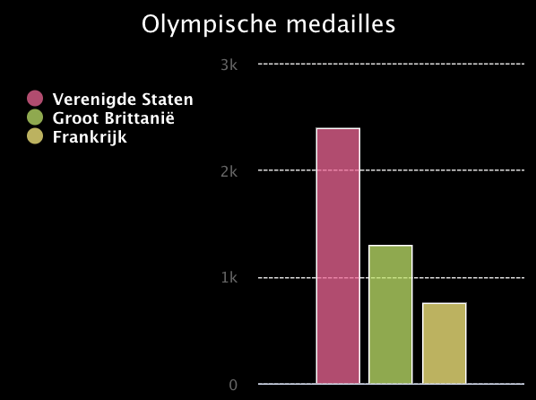
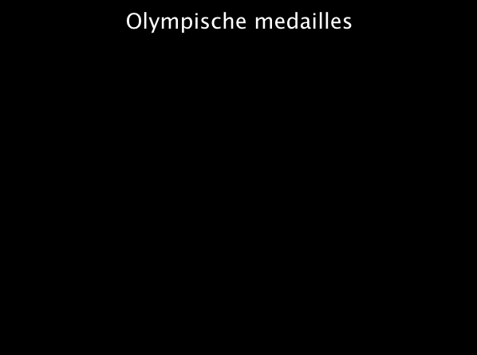

## Maak een grafiek

<div style="display: flex; flex-wrap: wrap">
<div style="flex-basis: 200px; flex-grow: 1; margin-right: 15px;">
Maak een grafiek en enkele lijsten met gegevens die je ermee wilt weergeven.
</div>
<div>
{:width="300px"}
</div>
</div>

--- task ---

Open het [Kampioenen in kaart brengen startproject](https://editor.raspberrypi.org/nl-NL/projects/charting-champions-starter){:target="_blank"}. De Raspberry Pi code-editor wordt geopend in een ander browsertabblad.

Als je een Raspberry Pi-account hebt, kun je op de **Save**-knop klikken om een kopie van de startcode op te slaan in je bibliotheek.

Als je de code editor niet gebruikt in je browser, moet je de projectbestanden downloaden en misschien `pygal` installeren voordat je deze kunt importeren.

--- collapse ---

---
title: Offline projectbestanden
---

Download de projectbestanden, pak ze uit en sla ze op op je computer. Voor deze stap heb je `starter.py` nodig, de andere bestanden zullen later in het project worden gebruikt.

--- /collapse ---

--- collapse ---
---
title: Installeer pygal
---

### In Windows
In de **opdrachtprompt** typ je het volgende en druk je op de <kbd>Enter</kbd> toets:

```
pip install pygal
```

Wacht tot de installatie is voltooid en ga vervolgens verder met het project.

### Op een Mac
In de **Terminal** typ je het volgende en druk je op de <kbd>Enter</kbd> toets:

```
pip3 install pygal
```

Wacht tot de installatie is voltooid en ga vervolgens verder met het project.

### Op Linux, inclusief Raspberry Pi OS
In de **Terminal** typ je het volgende en druk je op de <kbd>Enter</kbd> toets:

```
pip install pygal
```

Wacht tot de installatie is voltooid en ga vervolgens verder met het project.

--- /collapse ---

--- /task ---

Het startproject bevat al code om de `pygal` bibliotheek te importeren, die je gaat gebruiken om je grafiek te maken.

--- code ---
---
language: python
filename: main.py
line_numbers: true
line_number_start: 1
line_highlights: 1
---

from pygal import bar

--- /code ---

### Maak een grafiek

--- task ---

Zoek de opmerking `# Maak een grafiek` en voeg code eronder toe om een staafdiagram te maken met de naam `grafiek`. Geef je grafiek een titel, en zet deze tussen 2 ronde haakjes ( ).

--- code ---
---
language: python
filename: main.py
line_numbers: true
line_number_start: 4 
line_highlights: 5
---
# Maak een grafiek
grafiek = Bar(title='Olympische medailles')

--- /code ---

--- /task ---

--- task ---

Roep `grafiek.render()` aan om de grafiek weer te geven.

--- code ---
---
language: python
filename: main.py
line_numbers: true
line_number_start: 11 
line_highlights: 12
---
# Toon de grafiek
grafiek.render()
--- /code ---

--- /task ---

--- task ---

**Test:** Voer je code uit om de grafiek te zien. Deze zal leeg zijn omdat er nog geen gegevens in geladen zijn.

{:width="300px"}

**Fouten opsporen**: Als je een foutmelding ziet over `Bar()` of `grafiek.render()` die `not defined` (niet gedefinieerd) zijn:

 - Als de fout `Bar()` is, zorg er dan voor dat er een hoofdletter B aan het begin staat en haakjes aan het einde
 - Als de fout voor `grafiek.render()`is, controleer dan of deze een `.` heeft tussen `grafiek` en `render`, en kijk ook of je de haakjes aan het einde niet bent vergeten

**Fouten opsporen**: Als je de Raspberry Pi code editor niet gebruikt, en de grafiek verschijnt niet wanneer je de code laat uitvoeren, vervang dan `grafiek.render()` door `grafiek.render_in_browser()`.

--- /task ---

### Voeg wat gegevens toe

Python kan gerelateerde gegevens opslaan als een **lijst**. Je kunt lijsten maken met vierkante haakjes `[]`. Items in een lijst worden gescheiden door komma's.

--- task ---

Maak drie lijsten met gegevens die je in je grafiek wilt weergeven.

Elke lijst bevat de naam van een land en het aantal medailles dat dat land heeft gewonnen.

--- code ---
---
language: python
filename: main.py
line_numbers: true
line_number_start: 7 
line_highlights: 8-10
---
# Voeg gegevens toe aan de grafiek
us = ['Verenigde Staten', 2399]
gb = ['Groot Brittanië', 1304]
fr = ['Frankrijk', 751]

--- /code ---

--- /task ---

Wanneer je iets in een lijst opslaat, krijgt het een **index**. Een index is een getal dat je de positie van een item in een lijst aangeeft. Lijstindexen beginnen bij `0`, niet bij `1`.

--- task ---

Je kunt een item uit een lijst halen via de index. Bijvoorbeeld, `mijn_lijst[3]` haalt het **vierde** item op uit `mijn_lijst`, omdat indexen beginnen met `0`.

Gebruik de indexen van je lijsten en `grafiek.add()` om jouw gegevens weer te geven. De naam van het land bij item 0 zal worden gebruikt als categorielabel voor de grafiek en het aantal medailles bij item 1 zal de hoogte van de balk bepalen.

--- code ---
---
language: python
filename: main.py
line_numbers: true
line_number_start: 10 
line_highlights: 12-14
---
gb = ['Groot Brittanië', 1304]

grafiek.add(us[0], us[1])
grafiek.add(gb[0], gb[1])
grafiek.add(fr[0], fr[1])

--- /code ---

--- /task ---

--- task ---

**Test:** Voer je code uit om de grafiek te zien.

{:width="300px"}

**Fouten opsporen**: Als je een bericht ziet over een `IndexError`, probeert je code een waarde op te halen uit een lijstindex die niet bestaat (bijv. `us[2]`). Om dit op te lossen:
 - Controleer elk van je `grafiek.add` regels om er zeker van te zijn dat je alleen `0` en `1` als indexen gebruikt.
 - Controleer de regels waar je jouw lijsten hebt gemaakt. Zorg ervoor dat elke lijst twee items bevat, gescheiden door een komma.

--- /task ---

--- task ---

Laad nu nog twee teams door nieuwe lijsten en `grafiek.add()` aanroepen toe te voegen.

--- code ---
---
language: python
filename: main.py
line_numbers: true
line_number_start: 7 
line_highlights: 11-12, 17-18
---
# Voeg gegevens toe aan de grafiek
us = ['Verenigde Staten', 2399]
gb = ['Groot Brittanië', 1304]
fr = ['Frankrijk', 751]
ge = ['Duitsland', 655]
ch = ['China', 636]

grafiek.add(us[0], us[1])
grafiek.add(gb[0], gb[1])
grafiek.add(fr[0], fr[1])
grafiek.add(ge[0], ge[1])
grafiek.add(ch[0], ch[1])

--- /code ---

--- /task ---

--- task ---

**Test:** Voer je code uit om de bijgewerkte grafiek te zien. Probeer op de naam van de Verenigde Staten te klikken. Kijk vervolgens hoe de schaal van de grafiek verandert.

{:width="300px"}

**Fouten opsporen**: Als je een bericht ziet over een `IndexError`, probeert je code een waarde op te halen uit een lijstindex die niet bestaat (bijv. `fr[2]`). Om dit op te lossen:
 - Controleer elk van je `grafiek.add` regels om er zeker van te zijn dat je alleen `0` en `1` als indexen gebruikt.
 - Controleer de regels waar je jouw lijsten hebt gemaakt. Zorg ervoor dat elke lijst twee items bevat, gescheiden door een komma.

--- /task ---

--- save ---
