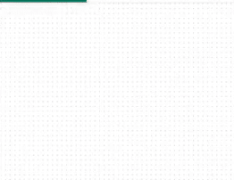
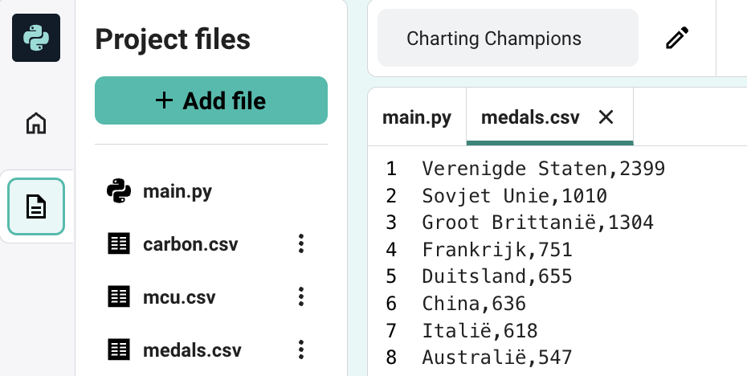
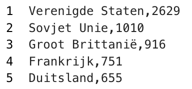
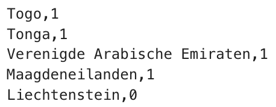
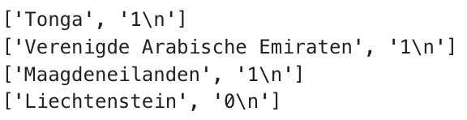

## Gegevens uit een bestand lezen

De grafiek ziet er goed uit! Maar bijna 150 landen hebben deelgenomen aan de Olympische Spelen. Om ze in kaart te brengen, ga je hun gegevens uit een bestand laden. Het scheelt een hoop typwerk!

{:width="300px"}

**Computers en gegevens** Je begint net te leren hoe je je computer met gegevens kunt laten werken. Computers kunnen geweldige dingen doen met de juiste gegevens. En ze kunnen in minuten meer gegevens lezen dan een mens in jaren. Python is een van de beste programmeertalen die er zijn voor data. Het YouTube-algoritme, dat de video's uitkiest die jij te zien krijgt, is gemaakt met Python.

--- task ---

Open het [tweede startproject](https://editor.raspberrypi.org/nl-NL/projects/charting-champions-second-starter){:target="_blank"}. The Raspberry Pi code editor will open in another browser tab.

Als je een Raspberry Pi-account hebt, kun je op de **Save**-knop klikken om een kopie van de startcode op te slaan in je bibliotheek.

--- collapse ---

---
title: Offline werken
---

Voor deze stap heb je `starter2.py` en de `.csv` bestanden nodig.

--- /collapse ---

--- /task ---

Er zijn verschillende `.csv` bestanden opgenomen in dit startproject die de gegevens bevatten die je nodig hebt voor je grafieken.

--- task ---

Open `medals.csv` en bekijk de gegevens daarin. Bekijk hoe elke regel een teamnaam heeft en het aantal medailles dat ze hebben gewonnen, gescheiden door een komma.

--- /task ---

**CSV-bestanden** zijn bestanden met door komma's gescheiden waarden. Ze bevatten gegevens in rijen en kolommen, zoals een tabel. Elke regel is een rij, waarbij komma's de waarden van die rij in kolommen scheiden.
{:width="200px"}

Je moet elke regel van `medals.csv` in Python omzetten in een tekstreeks en een getal, zoals in de lijsten die je hebt gemaakt.

--- task ---

Klik op het tabblad `main.py` en voeg code toe om het bestand in een variabele te laden door `with open() as`. Gebruik vervolgens een `for` lus om elke regel van de variabele `af te drukken`.

Met de `for` lus kun je code herhalen. Je laadt dus met slechts een paar regels code honderden teams in jouw grafiek!

[[[generic-python-file-read]]]

--- code ---
---
language: python
filename: main.py
line_numbers: true
line_number_start: 8 
line_highlights: 9-11
---
# Voeg gegevens toe aan de grafiek
with open('medals.csv') as f:
    for lijn in f:
        print(lijn)
--- /code ---

--- /task ---

--- task ---

**Test:** Voer je code uit en kijk naar de tekst die wordt afgedrukt.

Merk op dat elke regel twee waarden heeft, gescheiden door komma's.

**Fouten opsporen:** Als de code niet werkt, zorg er dan voor dat je deze hebt ingesprongen onder de regel `with`, zoals in het bovenstaande voorbeeld.

--- /task ---

Elke string die door jouw lus wordt afgedrukt, bestaat uit twee stukken, gescheiden door een komma. Je functie `grafiek.add()` heeft elk van deze onderdelen als afzonderlijke invoer nodig.

De functie `split()` verdeelt een string in een lijst, net zoals de lijsten die je eerder hebt gemaakt. De functie `split(',')` maakt een nieuw lijstitem telkens wanneer er een komma staat.

--- task ---

Plaats een `#` voor de code die `regel`afdrukt. Hierdoor wordt die code omgezet in een opmerking, zodat Python deze zal negeren.

Gebruik de `split()` methode om elke tekstreeks op te splitsen bij een `,` en sla vervolgens het eerste en tweede stuk op in een nieuwe lijst. Print deze lijsten vervolgens uit.

--- code ---
---
language: python
filename: main.py
line_numbers: true
line_number_start: 9 
line_highlights: 12-13
---
with open('medals.csv') as f:
    for lijn in f:
        #print(lijn)
        stukken = lijn.split(',') # Verdeelt de tekenreeks in een lijst
        print(stukken) # Druk elke lijst af
--- /code ---

**Tip:** `split()` kan een string splitsen in een lijst rond elke gewenste tekst. Je kunt splitsen op leestekens, een letter of zelfs hele woorden.

--- /task ---

--- task ---

**Test:** Voer je code uit en kijk naar de tekst die wordt afgedrukt. Elke regel moet een lijst zijn met twee items. Het zal je misschien opvallen dat het tweede item aan het eind `\n` heeft. `\n` is meestal onzichtbaar. Het vertelt de computer dat het het einde van de regel in een bestand heeft bereikt.

{:width="400px"}

**Fouten opsporen:** Als je `stukken` een lijst afdrukt met slechts één item, controleer dan of je `','` in de `()` van `line.split()` hebt.

**Fouten opsporen:** Als je een bericht ziet dat `split` 'not defined' is, controleer dan of je `regel.` ervoor hebt toegevoegd.

--- /task ---

--- task ---

Laad jouw gegevens in de grafiek als onderdeel van je `for` lus. `team` is een tekenreeks en kan dus als label in de grafiek worden gebruikt. `medaille` is momenteel een string, maar moet worden omgezet naar een getal. Je kunt de functie `int()` gebruiken om een string in een getal **om te zetten**.

--- code ---
---
language: python
filename: main.py
line_numbers: true
line_number_start: 9 
line_highlights: 14-16
---
with open('medals.csv') as f:
    for lijn in f:
        #print(lijn)
        stukken = lijn.split(',')
        #print(stukken)
        team = stukken[0]
        medailles = stukken[1]
        grafiek.add(team, int(medailles))  # Maak van medailles een getal
--- /code ---

**Tip:** Je kunt nu `#` gebruiken om `print(stukken)` ook in een opmerking om te zetten.

--- /task ---

--- task ---

**Test:** Voer je code uit en kijk naar de grafiek die wordt gemaakt. Beweeg de muis over een aantal balken of klik op de namen van teams om ze toe te voegen aan of te verwijderen uit het de grafiek.

{:width="400px"}

**Fouten opsporen:** Als je grafiek leeg is, controleer dan of je `int(medailles)` hebt opgenomen in je `grafiek.add()`.

**Fouten opsporen**: Als je een bericht ziet over een `IndexError`, dan probeert je code een waarde op te halen uit een lijstindex die niet bestaat (bijv. `stukken[2]`). Om dit op te lossen:
 - Controleer elk van je `team` en `medaille` variabelen om er zeker van te zijn dat je alleen `0` en `1` als indexen gebruikt.
 - Controleer de afgedrukte `stukken` lijst om er zeker van te zijn dat deze twee items bevat: ['Tonga', '1\n']</code>, en niet `['Tonga,1\n']`. Als dat niet zo is, controleer dan dat je een `','` hebt in de `()` van de `line.split()`.
 - Controleer of er geen lege regel onderaan je .csv-bestand staat.

--- /task ---

--- save ---
