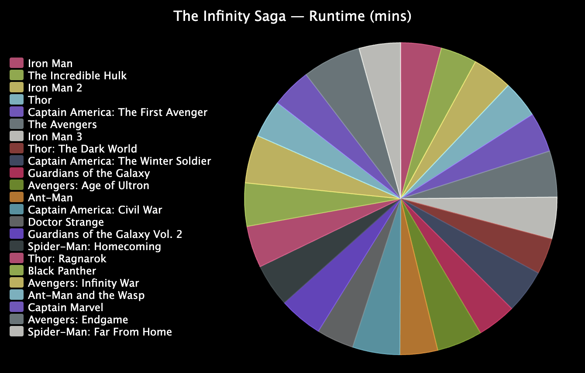

## Verbeter je project

In deze stap kun je wijzigingen aanbrengen in hoe je grafiek eruitziet of welke gegevens deze gebruikt.

{:width="300px"}

### Gebruik een taartdiagram
Probeer een taartdiagram te gebruiken voor een ander uiterlijk, of om te laten zien hoe iets is verdeeld.

--- task ---

Om een taartdiagram te maken in plaats van een staafdiagram, verander dan de import vanuit `pygal` naar `Pie` in plaats van `Bar`. Doe hetzelfde voor de functie die je aanroept om de `grafiek`te maken.

--- /task ---

### Gebruik een andere verzameling gegevens
Je kunt allerlei gegevens van een `.csv` bestand laden en in kaart brengen met het programma dat je hebt geschreven.

--- task ---

**Kies:** Kies een ander gegevensbestand voor je project. Er zijn er twee beschikbaar:

 - `mcu.csv` is de looptijd en het bruto-inkomen van de Marvel Cinematic Universe-films
 - `carbon.csv` is de totale (duizenden tonnen) en per persoon (ton) kooldioxide-uitstoot van verschillende landen en regio's

--- /task ---

--- task ---

Verander de code die leest uit `medailles.csv` om gegevens uit je nieuwe bestand te lezen.

Deze bestanden bevatten meer dan één kolom met getallen. Gebruik indexen uit de `tally` lijst om te kiezen welke u aan uw diagram wilt toevoegen.

De kooldioxidegegevens gebruiken getallen met decimalen. Om ze van tekstreeksen te converteren, moet je `float()` gebruiken in plaats van `int()`.

--- /task ---

--- collapse ---
---
title: Voltooid project
---

Je kunt het [voltooide project hier](https://editor.raspberrypi.org/nl-NL/projects/charting-champions-example){:target="_blank"} bekijken.

--- /collapse ---

--- save ---
