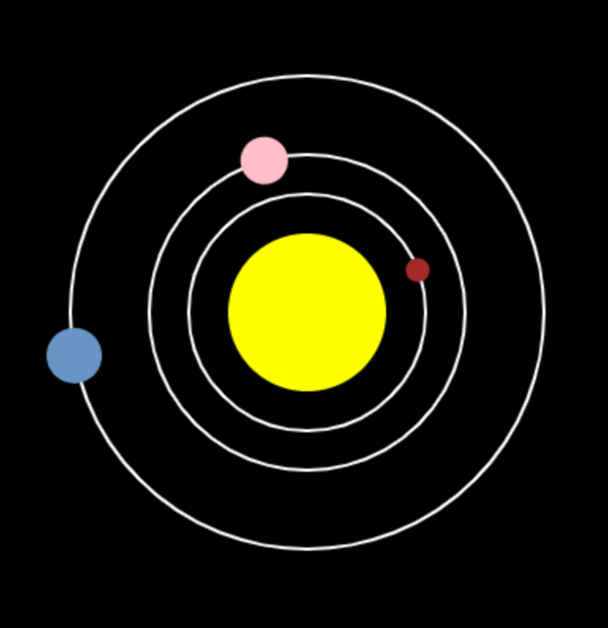

## Wat nu?

Als je het [Meer Python](https://projects.raspberrypi.org/en/pathways/more-python) pad volgt, kun je doorgaan naar het [Zonnestelsel](https://projects.raspberrypi.org/en/projects/solar-system-simulator/) project. In dat project maak je een model van het zonnestelsel om mensen over de planeten te leren.

--- print-only ---

--- /print-only ---

--- no-print ---

<iframe src="https://editor.raspberrypi.org/en/embed/viewer/solar-system-example" width="600" height="600" frameborder="0" marginwidth="0" marginheight="0" allowfullscreen>
</iframe>

--- /no-print ---

Als je meer plezier wilt hebben met het verkennen van Python, dan kun je een van [deze projecten](https://projects.raspberrypi.org/en/projects?software%5B%5D=python) uitproberen.
